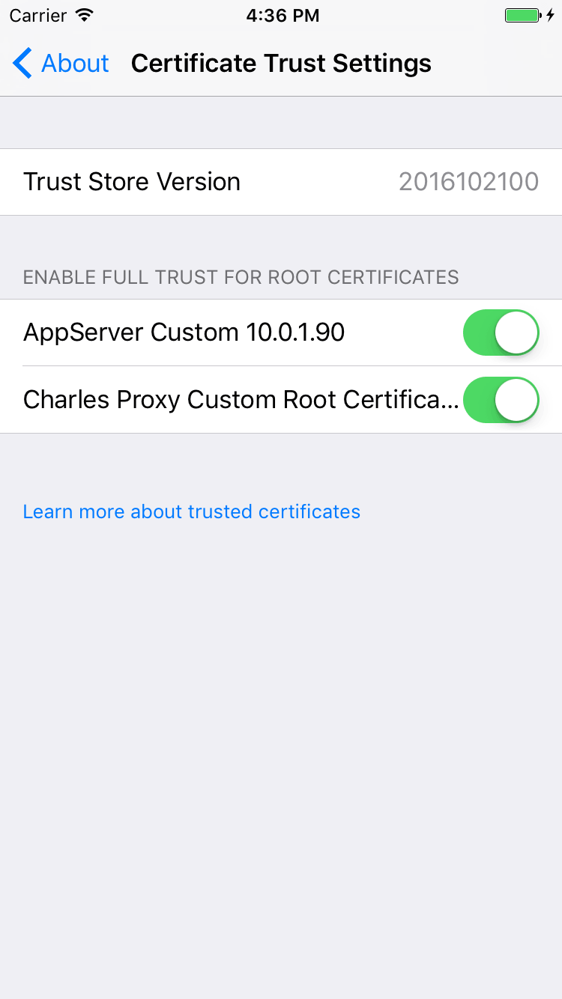

# FAQ
## 开启服务器后, 在浏览器为什么访问不了AppServer的网页
1. 检查服务器是否开启成功
2. 检查html文件夹内是否存在index.html文件, 不存在请重新生成, 传送门: [AppServerHTML](https://github.com/skytoup/AppServerHTML)

## iPhone无法安装App
1. 开启服务器后, 需要在地址栏输入的是**Config的host**, 不能填写127.0.0.1、localhost、0.0.0.0(会导致无法安装); 还有协议是`https`, 不是`http`
2. `iPhone`安装ipa需要在App详情的界面里面点击安装证书, 因为证书是自己生成的, 不能免证书安装(**iOS9以上系统安装完证书后, 还需要在设置那里信任一下证书**, 请参考: [苹果iOS9系统安装应用证书信任操作指导](http://jingyan.baidu.com/article/9c69d48f98e11813c8024e77.html))




3. 检查`iPhone`上安装的证书是不是旧的, 可以删除之后再安装一次
4. `ipa`的安装包只能是是ad证书所打包出来的(企业证书也可以？没有, 没法证实, 知道的可以告诉我一下😄)

## Linux上传apk一直失败
1. 检测日志, 如果报错如下

```
./aapt_centos: error while loading shared libraries: libpng12.so.0: cannot open shared object file: No such file or directory
```

请安装`libpng12`的库:

- centos: `yun install libpng12`
- 其它待测试...