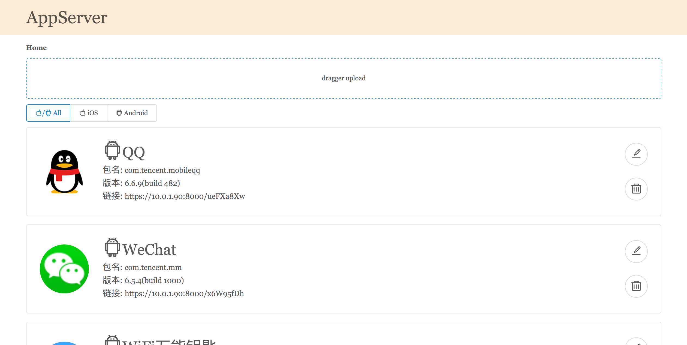
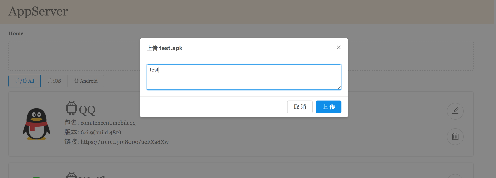
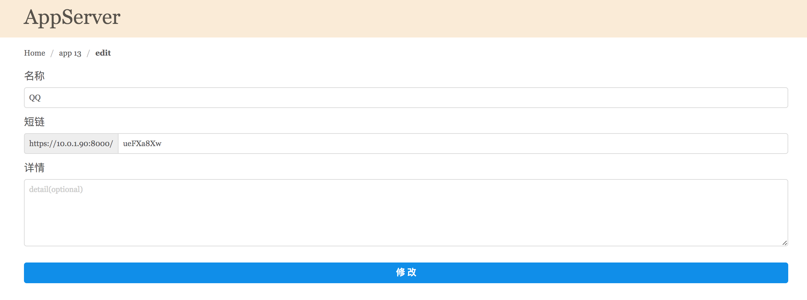

# AppServer


## 简介
基于`Sanic`搭建的简单`App`在线下载、安装服务器。可在线下载安装包, 或者`iPhone`在线安装ipa。

**首页**


**上传App**


**App详情页**


**App编辑页**


## 功能
- [x] `RESTful`的API
- [x] 上传apk、ipa文件 
- [x] 下载apk、下载ipa
- [x] 短链接进入下载页
- [x] App、版本管理
- [ ] 搜索App
- [ ] HTML更好兼容移动端

更多...

## 使用
### 环境
- Python > 3.5
- macOS(其它平台尚未测试)

### 配置(app/config.py)
把`Config`的`host`修改为本机地址


### 运行服务器
1. `git clone https://github.com/skytoup/AppServer`
2. `cd AppServer`
3. `pip install -r requirements.txt # 安装依赖`
4. `python main.py # 运行服务器`

5. 打开浏览器, 输入https://{Config的host}:8000, 回车

### 服务器的单元测试
1. `pip install -r requirements_test.txt`
2. `pytest -q tests`

### HTML前端
不是专业前端, 只是简单做了一个非常简陋的, 请勿介意😅

详情请看 👉 传送门: [AppServerHTML](https://github.com/skytoup/AppServerHTML)

### https证书
证书使用的是自签证书, 每次修改`Config`的`host`后, 会自动重新生成

### Tip
1. 开启服务器后, 需要在地址栏输入的是**Config的host**, 不能填写127.0.0.1、localhost、0.0.0.0; 还有协议是`https`, 不是`http`
2. `iPhone`安装ipa需要在App详情的界面里面点击安装证书, 因为证书是自己生成的, 不能免证书安装(**iOS9以上系统安装完证书后, 还需要在设置那里信任一下证书**, 请参考: [苹果iOS9系统安装应用证书信任操作指导](http://jingyan.baidu.com/article/9c69d48f98e11813c8024e77.html))

更详细请看 👉 [FAQ](FAQ.md)

## API
### 基本格式
```
{
	code: int,  # 请参考👇的表
	ok: bool,  # 是否请求成功
	msg: str,  # 请求返回的信息
	datas: dict/array,  # 请求返回的数据
}
```

| code | 描述 |
| --- | --- |
| 0 | 成功 |
| -1 | 失败 |

### 上传App安装包
	POST /upload/app
> Form
	
| 参数 | 必填 | 描述 |
|---|:-:|---|
| pcakage | y | 上传的安装包 |
| msg | n | 更新说明 |

> 返回datas: object or not(上传不存在的App时, 才有返回)

| 参数 | 描述 |
| --- | --- |
| id | App的id |
| type | 安装包类型, 0: iOS, 1: Android |
| name | 名称 |
| icon | 图标 |
| detail | 介绍 |
| short_chain | 短链接 |
| package_name | 包名 |
| create_at | 创建时间 |

### 获取App列表
	GET /apps/<app_type>/page/<page>?t=<time>
	
| 参数 | 必填 | 描述 |
|---|:-:|---|
| app_type | y | 安装包的类型: iOS、android、all |
| page | y | 页码, 从1开始 |
| time | y | 当获取第一页时, 为当前时间戳; 获取其它页时, 为获取第一页的时间戳 |

> 返回datas: array

| 参数 | 描述 |
| --- | --- |
| id | App的id |
| type | 安装包类型, 0: iOS, 1: Android |
| name | 名称 |
| icon | 图标 |
| detail | 介绍 |
| short_chain | 短链接 |
| package_name | 包名 |
| version_name | 最后上传安装包的版本名称 |
| version_code | 最后上传安装包的版本号 |
| create_at | 创建时间 |

### 获取App详情
	GET /apps/<app_id>
	
| 参数 | 必填 | 描述 |
|---|:-:|---|
| app_id | y | App的id |

> 返回datas: dict

| 参数 | 描述 |
| --- | --- |
| id | App的id |
| type | 安装包类型, 0: iOS, 1: Android |
| name | 名称 |
| icon | 图标 |
| detail | 介绍 |
| short_chain | 短链接 |
| package_name | 包名 |
| create_at | 创建时间 |

### 删除整个App(文件也删除)
	DELETE /apps/<app_id>

| 参数 | 必填 | 描述 |
|---|:-:|---|
| app_id | y | App的id |

> 返回datas: 无

| 参数 | 描述 |
| --- | --- |
|  |  |

### 修改App信息
	PUT /apps/<app_id>
> Json
	
| 参数 | 必填 | 描述 |
|---|:-:|---|
| app_id | y | App的id |
| - | - | - |
| name | n | 名称 |
| short_chain | n | 短链 |
| detail | n | 简介 |

> 返回datas: 无

| 参数 | 描述 |
| --- | --- |
|  |  |

### 获取App的版本列表
	GET /apps/<app_id>/versions/page/<page>?t=<time>
	
| 参数 | 必填 | 描述 |
|---|:-:|---|
| app_id | y | App的id |
| page | y | 页码, 从1开始 |
| time | y | 当获取第一页时, 为当前时间戳; 获取其它页时, 为获取第一页的时间戳 |

> 返回的datas: array

| 参数 | 描述 |
| --- | --- |
| id | App Version的id |
| app_id | App的id |
| version_name | 版本名 |
| version_code | 版本号 |
| package | 安装包下载地址 |
| size | 安装包大小 |
| update_msg | 更新信息 |
| create_at | 创建时间 |
| plist | plist下载地址, App类型为iOS时, 才有此字段 |

### 删除App的某个版本
	DELETE /apps/<app_id>/versions/<app_version_id>

| 参数 | 必填 | 描述 |
|---|:-:|---|
| app_id | y | App的id |
| app_version_id | y | App Version的id |

> 返回datas: 无

| 参数 | 描述 |
| --- | --- |
|  |  |

## 使用的开源项目
- [Sanic](https://github.com/channelcat/sanic): Async Python 3.5+ web server that's written to go fast
- [shortuuid](https://github.com/skorokithakis/shortuuid): A generator library for concise, unambiguous and URL-safe UUIDs. <http://www.stavros.io/>
- [sqlalchemy](https://github.com/zzzeek/sqlalchemy): See the development link for contribution guidelines <http://sqlalchemy.org/develop.html>
- [aiofiles](https://github.com/Tinche/aiofiles): File support for asyncio

# 相关文章
- [一个实现App在线下载、安装的工具​](http://skytoup.wicp.net/2017/03/01/%E4%B8%80%E4%B8%AA%E5%AE%9E%E7%8E%B0App%E5%9C%A8%E7%BA%BF%E4%B8%8B%E8%BD%BD%E3%80%81%E5%AE%89%E8%A3%85%E7%9A%84%E5%B7%A5%E5%85%B7/)

# 联系方式
- QQ：875766917，请备注
- Mail：875766917@qq.com